# System Architecture & Data Flow: OCR Platform

This document outlines the **Async Event-Driven Architecture** used in the OCR platform, detailing how data flows between Next.js, Redis (HyperLogLog), Inngest, and Supabase.

## High-Level Diagram

```mermaid
sequenceDiagram
    autonumber
    participant User as 👤 User (Browser)
    participant Edge as ⚡ Next.js (Edge/API)
    participant Redis as 🔴 Upstash Redis (HLL)
    participant Inngest as ⚙️ Inngest (Queue)
    participant OCR as 🧠 OCR AI (Google/Mistral)
    participant DB as 🟢 Supabase (Postgres)

    Note over User, DB: STEP 1: VISIT & ANALYTICS (Real-time)
    User->>Edge: Visits /tools/pdf-to-word
    Edge--)Redis: PFADD visitors:daily (Fire & Forget)
    Note right of Redis: ⚡ 5ms (User doesn't wait)
    Edge-->>User: Returns Page HTML

    Note over User, DB: STEP 2: UPLOAD & PROCESSING (Hybrid)
    User->>Edge: Uploads Document (POST /api/process)
    Edge--)Redis: INCR total_uploads (Counter)
    
    rect rgb(20, 20, 20)
        Note right of Edge: PATH A (Small Images < 4MB)
        Edge->>OCR: Send Base64 directly to AI
        OCR-->>Edge: Returns Text
        Edge->>DB: Save Usage Stats
        Edge-->>User: Returns Text Result
    end

    rect rgb(40, 40, 40)
        Note right of Edge: PATH B (PDFs / Large Files > 4MB)
        Edge->>Inngest: Send Event with Base64 Payload
        Edge-->>User: Returns { jobId: "xyz", status: "queued" }
        Inngest->>Edge: Triggers Worker (process-ocr)
        Edge->>OCR: Process with Mistral/Google
        Edge->>DB: Save Result & status="completed"
    end

    Note over User, DB: STEP 3: ANALYTICS UPDATE
    Edge--)Redis: PFADD documents:unique (HLL Analytics)

    Note over User, DB: STEP 4: RESULT POLLING (If Async)
    User->>Edge: Polls /api/status?id=xyz
    Edge->>DB: SELECT * FROM jobs WHERE id=xyz
    DB-->>Edge: Returns { status: "completed", result: "..." }
```

## detailed Data Flow Breakdown

### Phase 1: Zero-Latency Analytics (Redis HLL)
*   **Trigger:** User accesses any page.
*   **Action:** Next.js API (`/api/analytics/track`) sends a `PFADD visitors:{date} {ip_hash}` command to Upstash Redis.
*   **Mechanism:** "Fire and Forget" - The request is sent without blocking the main response.
*   **Benefit:** Zero impact on page load speed. 12KB fixed memory usage per day via HyperLogLog.

### Phase 2: Hybrid Upload & Processing
*   **Direct Upload:** The file is received as `FormData` and converted to an in-memory `Buffer` (or Base64). **No intermediate Storage Bucket is used** for privacy and speed.
*   **Path A (Sync for Images):** Small images are sent directly to Google/Mistral. The response is returned immediately in the same HTTP request.
*   **Path B (Async for PDFs/Large):**
    *   Files > 4MB or PDFs are offloaded to **Inngest**.
    *   The file content is sent as a `Base64` string inside the Inngest event payload.
    *   The user gets a `jobId` to poll for results.

### Phase 3: The Heavy Lifting (Background Worker)
*   **Trigger:** Inngest receives the event and triggers the `process-ocr` function.
*   **Action:**
    1.  Worker decodes Base64 payload.
    2.  Worker sends file to **OCR Service** (Google Vision/Mistral).
    3.  Worker saves extracted text to **Supabase Postgres** (not Storage Bucket).
    4.  Worker updates **Redis HLL** `documents:unique` count.

## Technology Stack Justification

| Component | Role | Why this choice? |
| :--- | :--- | :--- |
| **Upstash Redis** | **Speedometer** | Handles high-velocity counters & HLL (Analytics) in <5ms. |
| **Supabase** | **Vault** | Relational data (Postgres) for logging user quotas and job results. |
| **Inngest** | **Traffic Controller** | Manages queues and retries for large PDF processing. |
| **Next.js** | **Orchestrator** | Connects the frontend to these backend services. |
