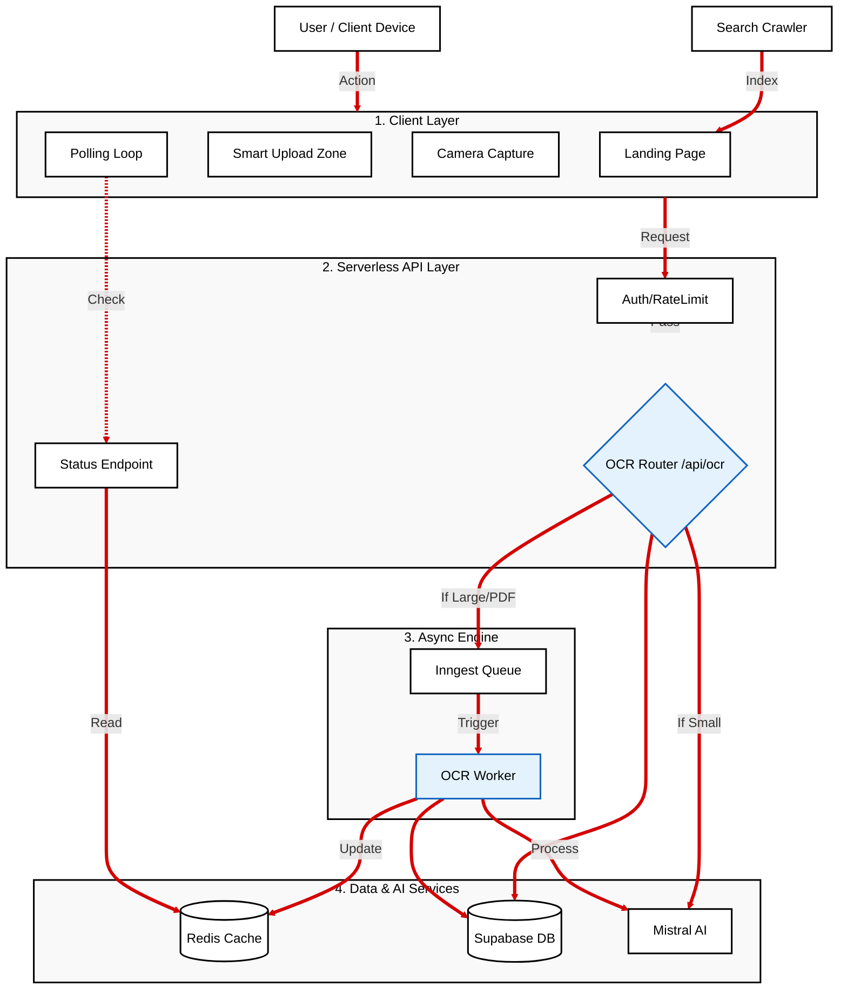
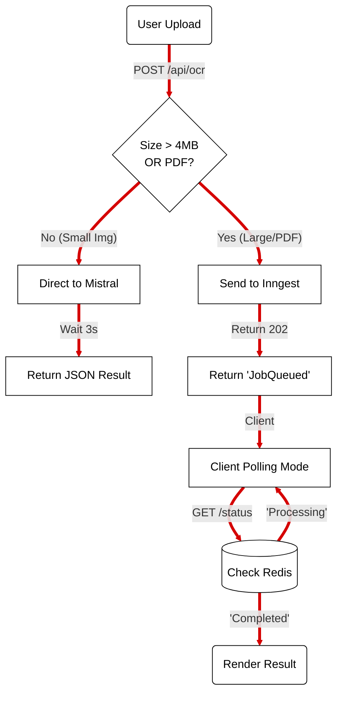
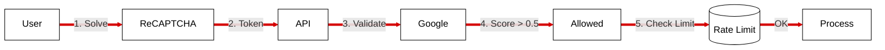
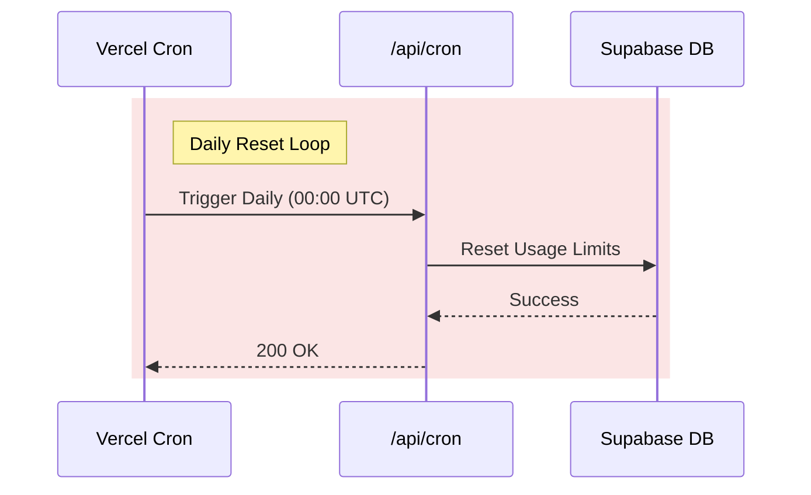

# System Architecture & Data Flow

This document provides a comprehensive visual and technical breakdown of the `ocr-extraction.com` platform.

## 1. Master Architecture (Vertical Stack)
*Best viewed on Desktop. Scroll down for detailed flows.*

## 2. Detailed Flows (Zoomed In)

### A. The Hybrid OCR Decision Flow
How the system decides between Fast (Sync) and Heavy (Async).

### B. Auto-Scaling & Security
How we handle scale and bots.

---

## 3. Component Deep Dive

### A. The Hybrid OCR Engine
This is the core innovation. It prevents timeout crashes while keeping valid requests fast.

*   **Logic**: The `/api/ocr` route acts as a **Traffic Cop**.
    *   **Images (< 4MB)**: Processed **Synchronously**. The user waits ~2-5 seconds. Response is immediate.
    *   **PDFs / Large Files**: Processed **Asynchronously**.
        1.  API generates a `Job ID`.
        2.  Payload is sent to **Inngest**.
        3.  API results `202 Accepted` to the Frontend.
        4.  Frontend enters "Polling Mode", asking Redis "Is Job X done?" every 2 seconds.

### B. Inngest Integration (The Async Backbone)
Inngest handles the "heavy lifting" that would otherwise kill a Vercel Serverless Function.

*   **Trigger**: `inngest.send({ name: "ocr/process.requested", data: { file... } })`
*   **Execution**:
    1.  **Step 0**: Set Redis status to `processing`.
    2.  **Step 1**: Upload file to Mistral (if PDF).
    3.  **Step 2**: Wait for Mistral (can take 30s-60s).
    4.  **Step 3**: On success, write result to Redis key `job:{id}` and expire in 24h.
*   **Reliability**: If Mistral fails, Inngest automatically retries 3 times.

### C. Data & Availability
*   **Supabase (Postgres)**: Stores Profile, Usage Logs, and Credits.
*   **Upstash (Redis)**: Handles Rate Limiting and Temporary Job Status storage.

### D. Security & Analytics
*   **ReCAPTCHA**: Protects API form bot abuse.
*   **GA4**: Tracks user behavior and conversion events.
*   **Resend**: Reliable email delivery infrastructure.

## 4. Cron Jobs (Automated Maintenance)

